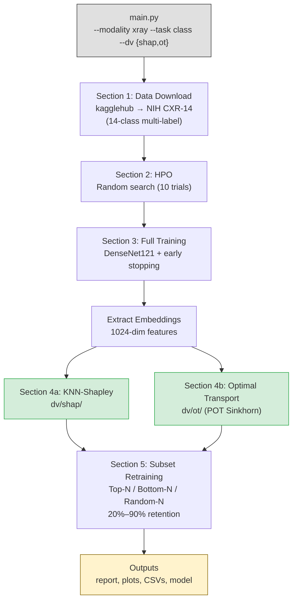

# Pipeline Architecture



## Directory Structure

```
src/
├── main.py                  # CLI entry point
├── xray_class/              # X-ray classification pipeline
│   ├── config.py            # Labels, paths, constants
│   ├── data.py              # kagglehub download + ChestXray14 dataset
│   ├── model.py             # DenseNet121 training, eval, embeddings
│   └── pipeline.py          # Orchestrator (sections 1–5)
└── dv/                      # Data valuation methods (reusable)
    ├── shap/knn_shapley.py  # KNN-Shapley (Jia et al. 2019)
    └── ot/sinkhorn.py       # Sinkhorn OT (POT library)
```
