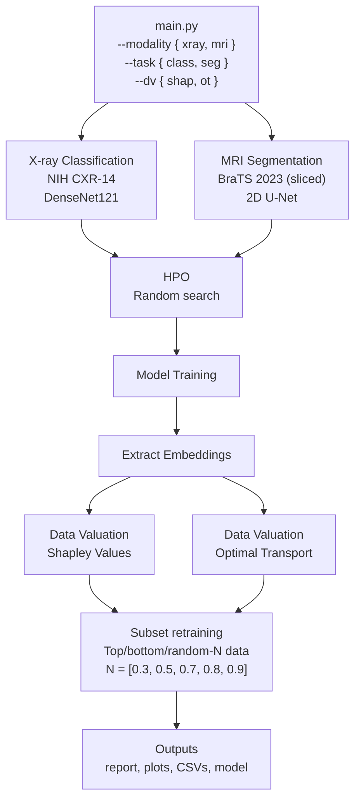

# Pipeline Architecture



All pipelines are dispatched through a single command. The modality and task flags select the task-specific module (data loader, model, training loop), while the data valuation methods (KNN-Shapley, OT) in `dv/` are shared across all pipelines since they operate only on embeddings and labels.

## File Structure

```
src/
├── main.py                  # Entry point
├── xray_class/              # X-ray classification pipeline
│   ├── config.py            # Labels, paths, constants
│   ├── data.py              # kagglehub download + ChestXray14 dataset
│   ├── model.py             # DenseNet121 training, eval, embeddings
│   └── pipeline.py          # Orchestrator (sections 1–5)
├── mri_seg/                 # MRI segmentation pipeline
│   ├── config.py            # Sub-region labels, paths, constants
│   ├── data.py              # BraTS dataset loader + 3D patch extraction
│   ├── model.py             # 2D U-Net training, eval, embeddings
│   └── pipeline.py          # Orchestrator (sections 1–6)
└── dv/                      # Data valuation methods (reusable)
    ├── shap/knn_shapley.py  # KNN-Shapley (Jia et al. 2019)
    └── ot/sinkhorn.py       # Sinkhorn OT (POT library)
```
