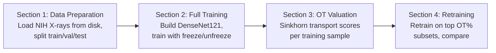

# Pipeline System Diagram

## Notes

### Section 1

Loads the full NIH Chest X-rays dataset from a local directory (designed for HPC). Binary labels: "No Finding" (0) vs "Has Finding" (1). Data is split into train/val/test using configurable fractions (default 80/10/10). Separate transforms are applied per split: augmentation (random crop, flip, rotation) for training, deterministic resize for val/test.

### Section 2

Builds DenseNet121 with an optional offline pretrained checkpoint (for HPC without internet). Replaces the classifier head with dropout + linear (1024 -> 1). Supports a two-phase training strategy: first freeze the backbone and train only the head with a higher learning rate, then unfreeze denseblock4 + norm5 at a configurable epoch and continue with a lower fine-tuning learning rate. Early stopping is based on validation AUC (not loss). An optional ReduceLROnPlateau scheduler tracks val AUC. After training, evaluates on all splits and plots loss/accuracy curves and a test-set ROC curve.

### Section 3

Extracts 1024-dim pooled embeddings from the trained model for both train and val splits using deterministic transforms. Computes per-sample data values via Optimal Transport: builds a cosine-distance cost matrix between train and val embeddings, solves the Sinkhorn transport plan with entropic regularisation, then row-normalises the plan and scores each training sample by how much transport mass lands on correctly-labelled validation samples. Saves OT values as both .npy and .csv with image IDs.

### Section 4

Validates the OT rankings by retraining DenseNet121 from scratch on subsets of the training data, keeping only the top X% by OT score (default: 95%, 90%, 85%, 80%, 75%). Each subset run uses fresh weights and the same freeze/unfreeze strategy. The 100% baseline is included from Section 2. If top-OT subsets maintain or improve performance over the full dataset, the OT rankings are meaningful — low-value samples can be pruned without hurting generalisation. Results are saved as CSV and accuracy-vs-size plots.
