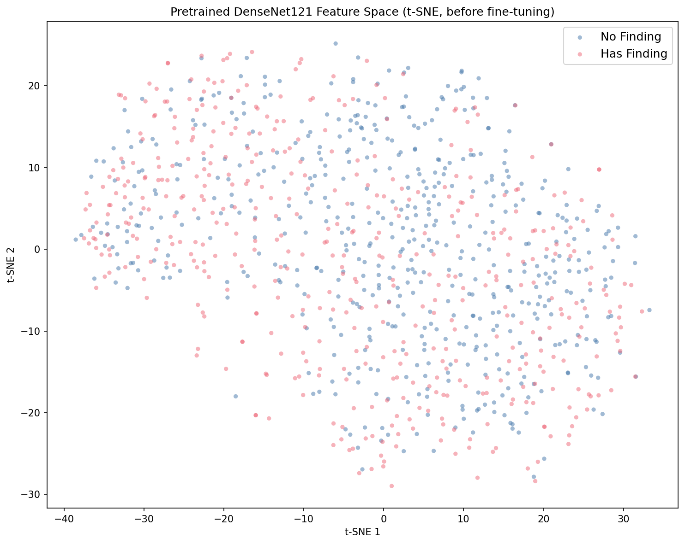
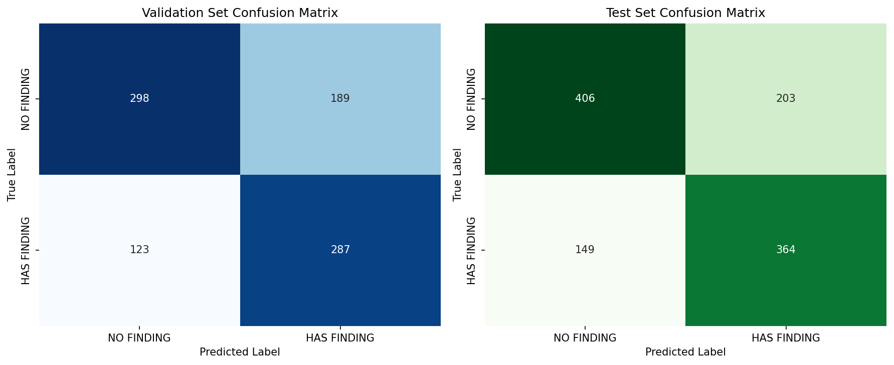
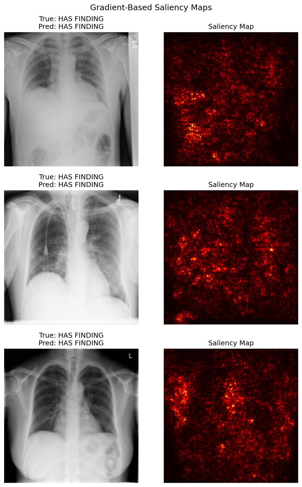
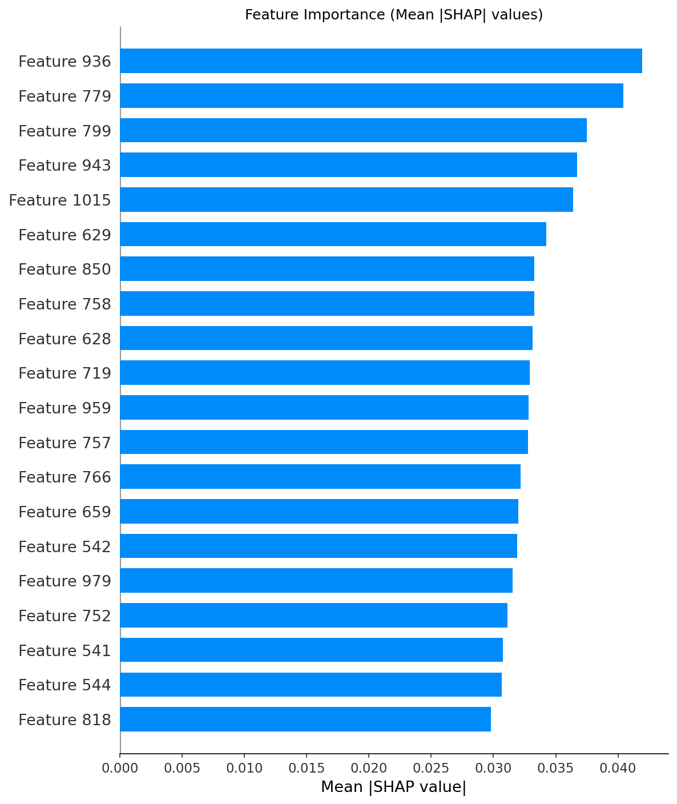
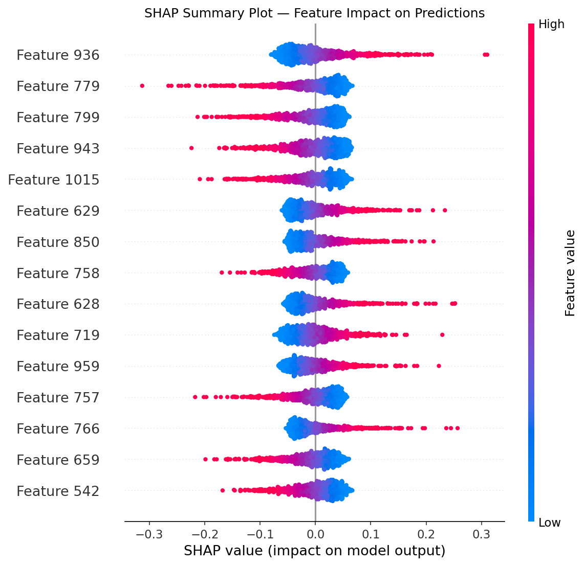
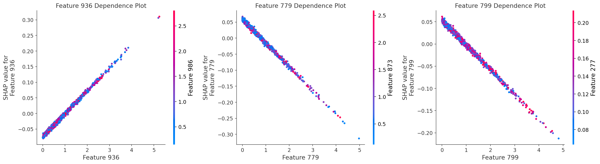
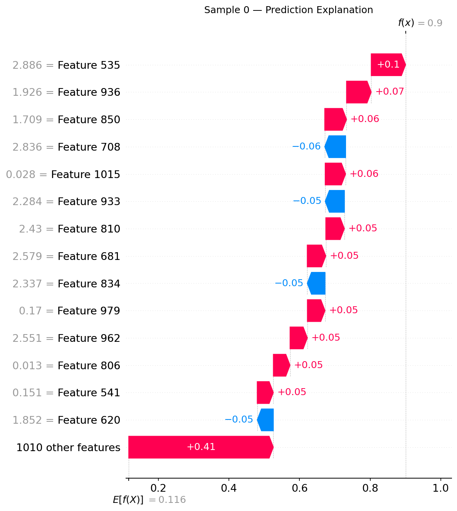
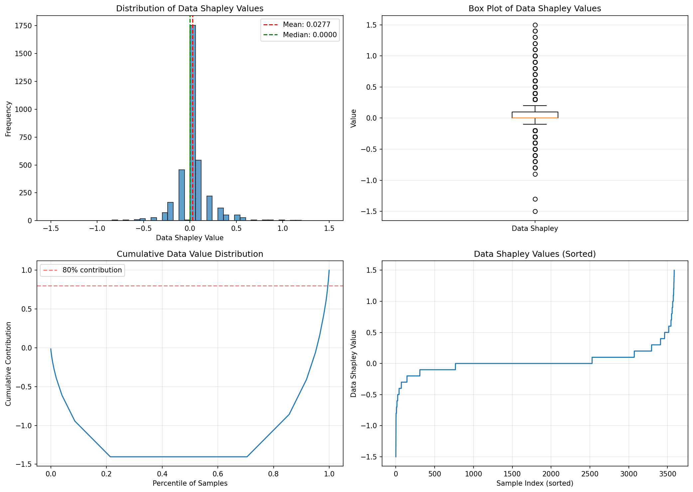
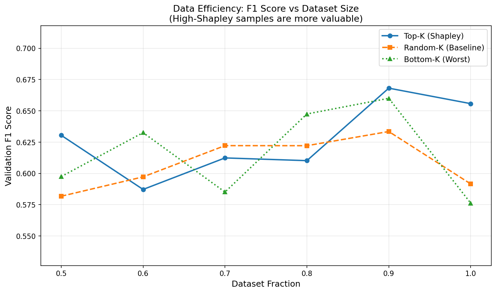

# X-Ray Shapley (Python Script)

## Overview

This is the standalone Python-script version of the [`xray-shapley`](../xray-shapley/) notebook pipeline. Same end-to-end logic — download chest X-rays, fine-tune DenseNet121, compute SHAP explanations, run KNN-Shapley data valuation — but packaged as `python main.py` with all output tee'd to a log file and all plots saved as PNGs.

**Core research question**: Which training samples actually help a chest X-ray classifier, and which ones hurt it?

### Dataset

[NIH Chest X-rays](https://www.kaggle.com/datasets/nih-chest-xrays/data) **5% sample** (~5,606 images, ~2.3 GB). Binary classification: "No Finding" (healthy) vs. "Has Finding" (any disease). Change `KAGGLE_DATASET` in `pipeline/config.py` to use the full 45 GB dataset.

## Quick Start

From the repository root:

```bash
make setup                                           # install all dependencies
cd xray-shapley-py && uv run --project .. python main.py   # run the full pipeline
```

All output goes to `outputs/output.txt`. Plots land in `outputs/plots/`. Results (CSV, NPY) land in `outputs/results/`.

## Pipeline Walkthrough

### Section 1: Data Download and Preparation

**What it does**: Downloads the NIH Chest X-rays 5% sample from Kaggle via `kagglehub`, copies it into `outputs/data/`, and prints the directory structure.

**Why it matters**: Reproducibility. Anyone with Kaggle API credentials can re-run this and get the exact same dataset.

**Output**: `outputs/data/sample/images/` containing ~5,606 PNG chest X-ray images plus `sample_labels.csv`.

---

### Section 2: Model Setup and Data Preparation

**What it does**: Loads pretrained DenseNet121 (the backbone of CheXNet), replaces the classifier head with `Linear(1024, 1)` for binary classification, creates stratified train/val/test splits, and visualises the pretrained feature space with t-SNE.

> **DenseNet121**: A convolutional neural network where each layer receives inputs from all preceding layers. This dense connectivity encourages feature reuse and requires fewer parameters than ResNet. DenseNet121 is the backbone of CheXNet (Rajpurkar et al. 2017).

> **t-SNE**: Projects 1024-dimensional embeddings to 2D for plotting. Points close together in 2D were similar in the original space.



**How to interpret**: Overlapping clusters indicate that the pretrained (ImageNet) features don't yet separate healthy from diseased X-rays well. Fine-tuning (Section 3) improves this separation.

**Key considerations**: t-SNE distorts global distances — only local neighbourhoods are trustworthy. Cluster sizes and inter-cluster gaps can be misleading.

---

### Section 3: Model Training

**What it does**: Fine-tunes the DenseNet121 classifier head with BCEWithLogitsLoss, early stopping on validation AUC, and class-imbalance weighting via `pos_weight`. Generates gradient-based saliency maps and extracts 1024-dim embeddings from the trained model.

> **Early stopping**: Monitors validation AUC each epoch and halts if no improvement for 3 epochs. Restores the best checkpoint.

> **Saliency maps**: Show which image regions most influence the model's prediction by backpropagating the output gradient to the input pixels.



**How to interpret**: The confusion matrices show true vs. predicted labels on both validation and test sets. Off-diagonal cells are misclassifications. Balanced errors across both classes suggest the `pos_weight` correction is working.



**How to interpret**: Bright regions in the saliency maps indicate which parts of the X-ray drove the prediction. Clinically, you would expect the lung fields (not image borders) to be highlighted. If borders dominate, the model may be relying on acquisition artefacts rather than anatomy.

**Key considerations**: Head-only training (default) is CPU-feasible but limited. Set `FINETUNE_ALL = True` in `pipeline/config.py` and use a GPU for better performance.

---

### Section 4: SHAP Feature-Level Analysis

**What it does**: Uses SHAP GradientExplainer on the classifier head to explain predictions in terms of the 1024 embedding dimensions. Generates summary, dependence, and waterfall plots.

> **SHAP values**: Each embedding dimension gets a per-prediction score. Positive = pushed toward "Has Finding", negative = pushed toward "No Finding". They sum (plus the base value) to the model's final output.



**How to interpret**: The bar chart shows the top embedding dimensions by mean |SHAP value|. These are the dimensions the classifier relies on most. Since embeddings are learned features (not hand-crafted), the dimension indices are opaque — what matters is the concentration of importance in a few dimensions.



**How to interpret**: Each dot is one test sample. The x-axis is the SHAP value (impact on prediction), and colour encodes the feature value (red = high, blue = low). A clear red-right / blue-left pattern for a feature means high values of that feature push toward "Has Finding".



**How to interpret**: Dependence plots show the relationship between a feature's value (x-axis) and its SHAP contribution (y-axis) for the top 3 features. Non-linear patterns indicate the feature has a threshold-like effect.



**How to interpret**: The waterfall plot decomposes a single prediction. Starting from the base value (average model output), each bar shows how one feature pushes the prediction up (red) or down (blue), arriving at the final score. This is useful for auditing individual predictions.

**Key considerations**: GradientExplainer is an approximation. SHAP values explain the *classifier head operating on embeddings*, not raw pixel contributions. For pixel-level explanations, see the saliency maps in Section 3.

---

### Section 5: Data Valuation with Shapley Values

This is the central section. It shifts from explaining *features* to valuing *training samples*.

**What it does**:
1. **KNN-Shapley** (k=10): For each validation image, scores the k nearest training neighbours by label agreement (+1/k for same label, -1/k for different). Accumulates over all validation samples.
2. **Quality detection**: Categorises samples as noisy, outlier, redundant, or high-value.
3. **Efficiency experiments**: Trains `nn.Linear(1024, 1)` heads on Top-K / Random-K / Bottom-K fractions of the training data and compares F1 scores.

> **KNN-Shapley**: A fast O(n log n) approximation of Data Shapley. Instead of retraining the model thousands of times, it uses neighbour relationships in embedding space.



**How to interpret**: The histogram shows the distribution of Shapley values across training samples. A roughly symmetric distribution centred near zero is typical. Long tails indicate a few highly influential (positive or negative) samples. The cumulative plot shows how total data value is distributed — a steep curve means a small fraction of samples account for most of the value.



**How to interpret**: The data efficiency plot compares three selection strategies at different dataset fractions (50%–100%). An ideal result shows Top-K (highest Shapley) above Random above Bottom-K (lowest Shapley). When Top-K at 70% matches or exceeds full-data performance, the bottom 30% was redundant or harmful.

**Key considerations**:
- KNN-Shapley approximation quality depends on the embedding space. Better embeddings → more accurate valuations.
- The linear head used in efficiency experiments is a proxy. Full DenseNet retraining would give more accurate (but much slower) results.
- "Noisy" samples may not be mislabeled — they could be genuinely ambiguous cases at the disease boundary.

## Architecture

```
DenseNet121 (pretrained ImageNet, fine-tuned on chest X-rays)
  → Frozen conv layers (head-only by default) or full fine-tuning (GPU)
  → Classifier head: Linear(1024, 1) with BCEWithLogitsLoss
  → Early stopping on validation AUC

After training:
  → Extract 1024-dim embeddings from penultimate layer
  → SHAP GradientExplainer on classifier head (feature-level)
  → KNN-Shapley on embeddings (sample-level data valuation)
  → Data efficiency experiments with nn.Linear heads
```

## Directory Structure

```
xray-shapley-py/
├── main.py                  # Entry point
├── pipeline/
│   ├── __init__.py
│   ├── config.py            # All constants, paths, hyperparameters
│   ├── data.py              # Section 1: download, organize, explore
│   ├── model.py             # Sections 2+3: DenseNet121, training, embeddings
│   ├── shap_analysis.py     # Section 4: SHAP explainer, values, plots
│   └── valuation.py         # Section 5: KNN-Shapley, quality, efficiency
├── outputs/
│   ├── data/                # GITIGNORED — downloaded dataset (~2.3 GB)
│   ├── models/              # GITIGNORED — densenet121_model.pt (~28 MB)
│   ├── embeddings/          # GITIGNORED — cached NPZ (~23 MB)
│   ├── plots/               # TRACKED — PNG visualisations for this README
│   ├── results/             # TRACKED — CSV, NPY final outputs
│   └── output.txt           # Full pipeline log (print output)
├── pyproject.toml           # UV workspace member
├── .gitignore
└── README.md                # This file
```

## Installation

### Prerequisites

- Python 3.11
- [uv](https://docs.astral.sh/uv/) package manager
- [Kaggle API credentials](https://github.com/Kaggle/kaggle-api#api-credentials)
- CUDA optional (head-only training runs on CPU)

### Setup

From the repository root:

```bash
make setup    # uv sync --all-packages --all-extras
```

### Run

```bash
cd xray-shapley-py && uv run --project .. python main.py
```

## References

- Lundberg & Lee (2017). [A Unified Approach to Interpreting Model Predictions](https://arxiv.org/abs/1705.07874) (SHAP)
- Ghorbani & Zou (2019). [Data Shapley: Equitable Valuation of Data for Machine Learning](https://arxiv.org/abs/1904.02868) (Data Shapley)
- Jia et al. (2019). [Efficient Task-Specific Data Valuation for Nearest Neighbor Algorithms](https://arxiv.org/abs/1908.08619) (KNN-Shapley)
- Rajpurkar et al. (2017). [CheXNet: Radiologist-Level Pneumonia Detection on Chest X-Rays](https://arxiv.org/abs/1711.05225) (CheXNet / DenseNet121)
- Huang et al. (2017). [Densely Connected Convolutional Networks](https://arxiv.org/abs/1608.06993) (DenseNet)
- Wang et al. (2017). [ChestX-ray8: Hospital-scale Chest X-ray Database](https://arxiv.org/abs/1705.02315) (NIH dataset)
