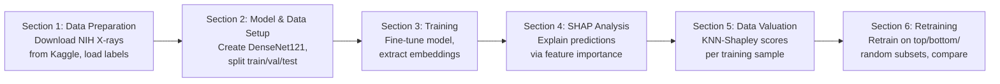

# Pipeline System Diagram

```mermaid
flowchart LR
    S1["Section 1: Data Preparation
    Download NIH X-rays
    from Kaggle, load labels"]
    S2["Section 2: Model & Data Setup
    Create DenseNet121,
    split train/val/test"]
    S3["Section 3: Training
    Fine-tune model,
    extract embeddings"]
    S4["Section 4: SHAP Analysis
    Explain predictions
    via feature importance"]
    S5["Section 5: Data Valuation
    KNN-Shapley scores
    per training sample"]
    S6["Section 6: Retraining
    Retrain on top/bottom/
    random subsets, compare"]

    S1 --> S2 --> S3 --> S4 --> S5 --> S6
```
