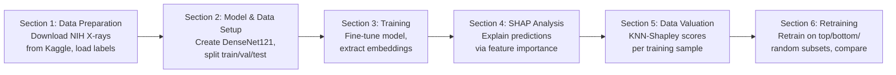

# Pipeline System Diagram

## Notes

### Section 1

Downloads the NIH Chest X-rays dataset from Kaggle. Binary labels: "No Finding" (0) vs "Has Finding" (1).

### Section 2

Loads DenseNet121 with ImageNet weights, replaces the classifier head with a single linear layer (1024 -> 1) for binary classification. Data is split 80/20 into train/test (stratified), then train is further split 80/20 into train/val. Final split: ~64% train / ~16% val / ~20% test.

### Section 3

Fine-tunes only the classifier head (feature layers frozen) using Adam for up to 10 epochs with early stopping (patience=3). The learning rate controls how much the model's weights update per training step, and weight decay applies L2 regularization to prevent overfitting. Both initial values are fixed constants (not tuned), but a ReduceLROnPlateau scheduler halves the learning rate when validation loss stops improving. After training, extracts 1024-dim embeddings from the penultimate layer via a forward hook for all splits. These embeddings are the input to Sections 4 and 5.

### Section 4

Runs SHAP (GradientExplainer) on the classifier head using 200 background samples. Produces summary plots, dependence plots, and waterfall plots showing which embedding dimensions drive predictions. This section aims to answer "why did the model make this choice?" around model interpretability.

### Section 5

Computes KNN-Shapley values (k=10) over the embedding space. For each validation sample, the k nearest training neighbours get +1/k (correct label) or -1/k (wrong label). This is an O(n log n) approximation to exact Data Shapley (which is infeasible at O(2^n)). Flags noisy samples (Shapley < -0.05), outliers (via local outlier factor), and redundant samples (|Shapley| < 0.01). This section aims to answer "which data points were actually helpful or not?" around data valuation.

### Section 6

Validates the Shapley rankings by retraining DenseNet121 from scratch on subsets at 20%, 50%, 80%, and 100% of training data. Three strategies: top-k (highest Shapley), bottom-k (lowest Shapley), and random-k. If top-k outperforms bottom-k and random, the Shapley rankings are meaningful.
